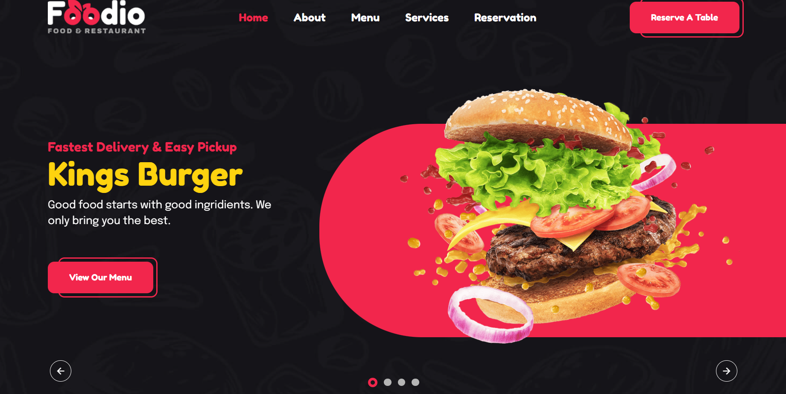
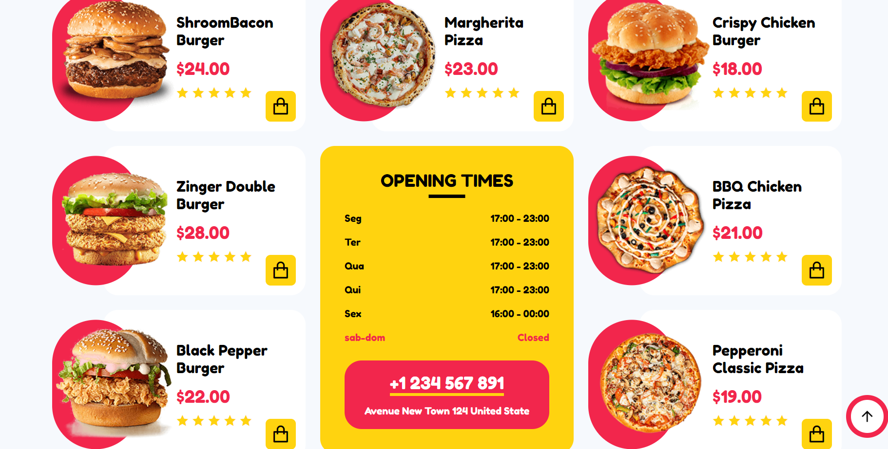
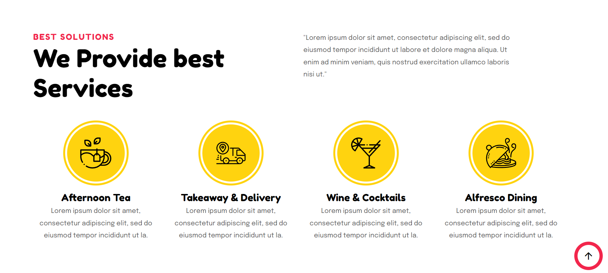
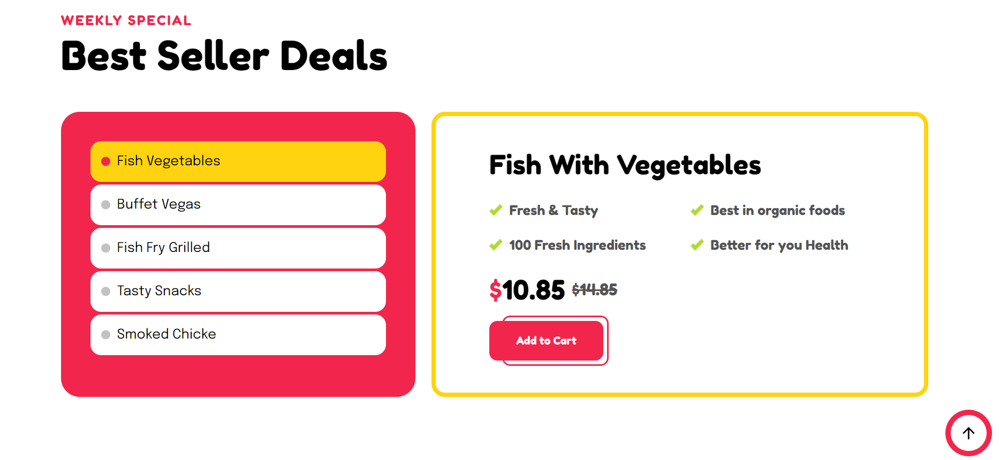
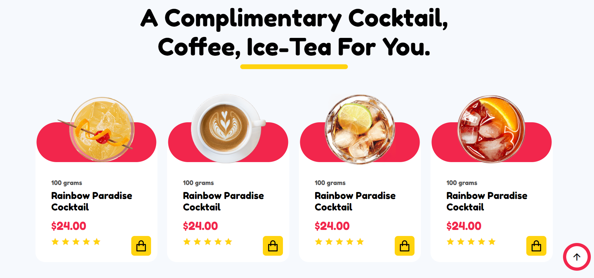

# Boas-vindas ao repositório do projeto Foodio delivery!

Seja muito bem-vindo(a) ao repositório do Projeto Foodio delivery Aqui você encontrará informações sobre o que foi desenvolvido neste projeto, bem como os principais aprendizados adquiridos durante o processo, para adquirir esse conhecimento, basta clicar na seta abaixo que o conteúdo se abrirá, boa leitura, espero que goste. 🙂

obs: caso queira ver o site no ar rodando basta clicar neste link: https://robson-aires.github.io/Restaurant/
 
 
 

  
<strong>👨‍💻 O que foi desenvolvido</strong>
 

  Este projeto foi desenvolvido com o intuito de aprimorar minhas habilidades em desenvolvimento web, especificamente utilizando as tecnologias CSS, HTML e JavaScript. O objetivo principal foi criar um site de delivery, proporcionando uma experiência interativa e agradável para os usuários. 

 

  
<strong>Habilidades que eu desenvolvi realizando este projeto.</strong>
 

  Nesse projeto eu utilizei:

* CSS: Utilizei CSS para estilizar o site, aplicando layouts responsivos, escolhendo cores atraentes e criando uma identidade visual coerente com o tema de delivery.
* HTML: O HTML foi utilizado para a estruturação do conteúdo do site, garantindo uma organização lógica e semântica dos elementos.
* JavaScript: A linguagem JavaScript foi empregada para adicionar interatividade ao site, como a implementação do slideshow, criação de animações suaves e manipulação dinâmica dos elementos da página.

 
 
 

 
 
 
 
 
 

 
 
 

 
 

 
 
 

 
 
 
